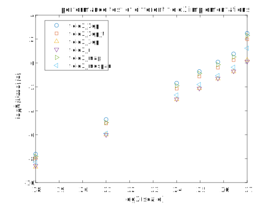

# test-mdspan

My first version is to index a one dimension array.

```cpp
class field3_1dp
{
protected:
    unsigned int Nx, Ny, Nz;

public:
    double* value = nullptr;
    field3_1dp(unsigned int _Nx, unsigned int _Ny, unsigned int _Nz)
        : Nx(_Nx)
        , Ny(_Ny)
        , Nz(_Nz)
    {
        value = new double[Nx * Ny * Nz];

        for (unsigned int i = 0; i < Nx * Ny * Nz; i++)
            value[i] = 0.;
    }

    ~field3_1dp() { delete[] value; }

    double& operator()(unsigned int i, unsigned int j, unsigned int k) { return value[i * Ny * Nz + j * Nz + k]; }

    int SizeX() { return Nx; }
    int SizeY() { return Ny; }
    int SizeZ() { return Nz; }
};
```

To accerlate the indexing to one dimension array, I use template to hard code the dimension numbers.

```cpp
template<unsigned int Nx, unsigned int Ny, unsigned int Nz>
class field3_1dp_t
{
public:
    double* value = nullptr;
    field3_1dp_t()
    {
        value = new double[Nx * Ny * Nz];

        for (unsigned int i = 0; i < Nx * Ny * Nz; i++)
            value[i] = 0.;
    }

    ~field3_1dp_t() { delete[] value; }

    double& operator()(unsigned int i, unsigned int j, unsigned int k) { return value[i * Ny * Nz + j * Nz + k]; }
};
```

But you can also store three dimension array in a class.

```cpp
class field3_3dp
{
protected:
    unsigned int Nx, Ny, Nz;

public:
    double*** value = nullptr;
    field3_3dp(unsigned int _Nx, unsigned int _Ny, unsigned int _Nz)
        : Nx(_Nx)
        , Ny(_Ny)
        , Nz(_Nz)
    {
        value = allocate_3d_array(Nx, Ny, Nz);
    }

    ~field3_3dp() { deallocate_3d_array(value, Nx, Ny); }

    double& operator()(unsigned int i, unsigned int j, unsigned int k) { return value[i][j][k]; }

    int SizeX() { return Nx; }
    int SizeY() { return Ny; }
    int SizeZ() { return Nz; }
};
```

However, three dimension array will lead to dicontigous memory.

So why not map a one dimension array to three dimension pointer?

```cpp
class field3_map
{
protected:
    unsigned int Nx, Ny, Nz;
    double*      value;
    double***    ptr3d;

public:
    field3_map(unsigned int _Nx, unsigned int _Ny, unsigned int _Nz)
        : Nx(_Nx)
        , Ny(_Ny)
        , Nz(_Nz)
        , value(new double[Nx * Ny * Nz])
    {
        ptr3d = new double**[Nx];
        for (unsigned int i = 0; i < Nx; ++i)
        {
            ptr3d[i] = new double*[Ny];
            for (unsigned int j = 0; j < Ny; ++j)
            {
                ptr3d[i][j] = value + (i * Ny + j) * Nz;
            }
        }
    }

    ~field3_map()
    {
        for (unsigned int i = 0; i < Nx; ++i)
        {
            delete[] ptr3d[i];
        }
        delete[] ptr3d;
        delete[] value;
    }

    double** operator[](unsigned int i) { return ptr3d[i]; }

    int SizeX() { return Nx; }
    int SizeY() { return Ny; }
    int SizeZ() { return Nz; }
};
```

Kokkos has `mdspan` to do this.

```cpp
class field3_mdspan
{
protected:
    unsigned int                                     Nx, Ny, Nz;
    double*                                          value;
    Kokkos::mdspan<double, Kokkos::dextents<int, 3>> m_mdspan;

public:
    field3_mdspan(unsigned int _Nx, unsigned int _Ny, unsigned int _Nz)
        : Nx(_Nx)
        , Ny(_Ny)
        , Nz(_Nz)
        , value(new double[Nx * Ny * Nz])
        , m_mdspan(value, Nx, Ny, Nz)
    {}

    ~field3_mdspan() { delete[] value; }

    double& operator()(int i, int j, int k) { return m_mdspan[i, j, k]; }

    int SizeX() { return Nx; }
    int SizeY() { return Ny; }
    int SizeZ() { return Nz; }
};
```

Here is comparsion.

<table>
    <tr>
        <td align="center">class</td>
        <td colspan="6" align="center">time(s)</td>
    </tr>
    <tr>
        <td align="center">scale</td>
        <td align="center">field3_1dp</td>
        <td align="center">field3_1dp_t</td>
        <td align="center">field3_3dp</td>
        <td align="center">field3_r</td>
        <td align="center">field3_map</td>
        <td align="center">field3_mdspan</td>
    </tr>
    <tr>
        <td align="center">134217728</td>
        <td align="center">5.57658</td>
        <td align="center">3.96567</td>
        <td align="center">1.19348</td>
        <td align="center">1.0934</td>
        <td align="center">4.90802</td>
        <td align="center">2.35261</td>
    </tr>
    <tr>
        <td align="center">89915392</td>
        <td align="center">1.68941</td>
        <td align="center">1.18209</td>
        <td align="center">0.609244</td>
        <td align="center">0.620306</td>
        <td align="center">1.41848</td>
        <td align="center">0.780205</td>
    </tr>
    <tr>
        <td align="center">56623104</td>
        <td align="center">1.05672</td>
        <td align="center">0.761333</td>
        <td align="center">0.401177</td>
        <td align="center">0.408533</td>
        <td align="center">0.906887</td>
        <td align="center">0.480399</td>
    </tr>
    <tr>
        <td align="center">32768000</td>
        <td align="center">0.609183</td>
        <td align="center">0.456157</td>
        <td align="center">0.228897</td>
        <td align="center">0.228498</td>
        <td align="center">0.544337</td>
        <td align="center">0.286498</td>
    </tr>
    <tr>
        <td align="center">16777216</td>
        <td align="center">0.310148</td>
        <td align="center">0.225518</td>
        <td align="center">0.120197</td>
        <td align="center">0.122801</td>
        <td align="center">0.266692</td>
        <td align="center">0.155674</td>
    </tr>
    <tr>
        <td align="center">2097152</td>
        <td align="center">0.0377825</td>
        <td align="center">0.0300964</td>
        <td align="center">0.0156596</td>
        <td align="center">0.0155079</td>
        <td align="center">0.0317008</td>
        <td align="center">0.0169362</td>
    </tr>
    <tr>
        <td align="center">262144</td>
        <td align="center">0.00506641</td>
        <td align="center">0.00398439</td>
        <td align="center">0.00241431</td>
        <td align="center">0.00260458</td>
        <td align="center">0.00445506</td>
        <td align="center">0.00317016</td>
    </tr>
</table>

